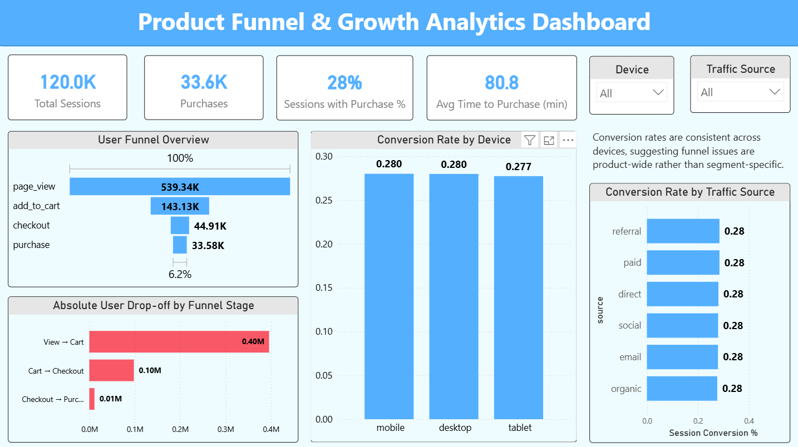
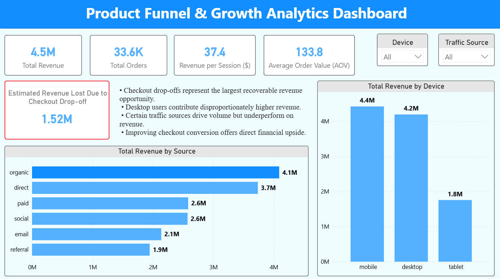
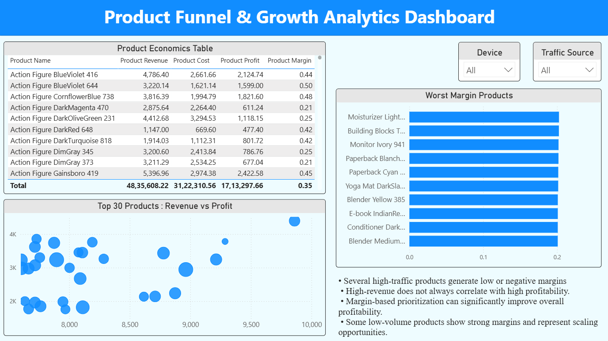
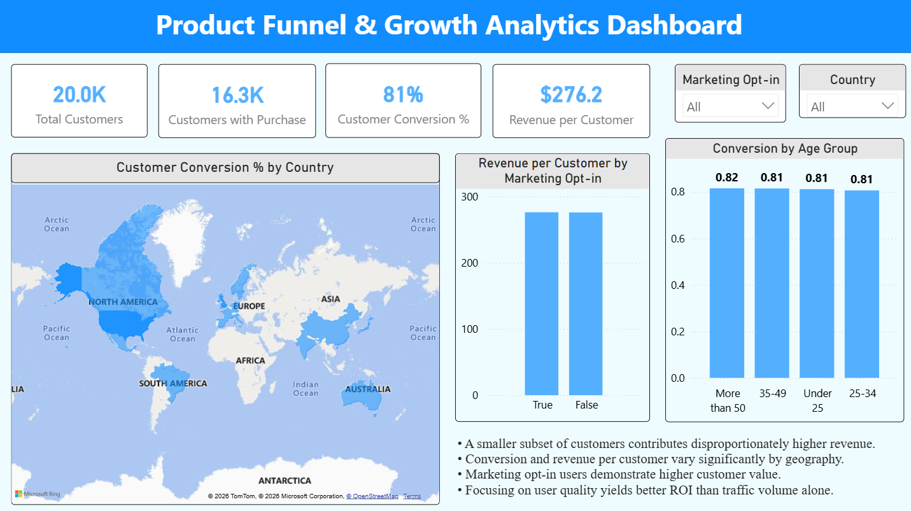

# Product Funnel & Growth Analytics Dashboard

## Overview
The Product Funnel & Growth Analytics Dashboard is an end-to-end business intelligence project built using Power BI to analyze and interpret e-commerce growth performance. The dashboard is designed to provide a structured, data-driven view of how users interact with a product, how effectively those interactions convert into revenue, and how customer and product-level factors influence overall business outcomes.

The project follows a realistic analytics workflow commonly used in product analytics and business intelligence roles, covering data ingestion, relational modeling, metric design, and executive-level visualization.

---

## Business Objectives
The primary objectives of this project are to:

- Analyze the complete user journey from initial interaction to purchase
- Identify major conversion drop-offs and friction points in the product funnel
- Quantify revenue impact resulting from user behavior and funnel inefficiencies
- Evaluate product-level performance in terms of revenue, cost, profit, and margin
- Assess customer quality using behavioral, demographic, and geographic dimensions
- Present insights in a clear, structured dashboard suitable for business stakeholders

---

## Data Sources
The analysis is based on multiple structured datasets representing a typical e-commerce environment:

- **customers.csv**
  - Customer identifiers, age group, country, and marketing opt-in information

- **sessions.csv**
  - Session-level metadata including device type, traffic source, country, and timestamps

- **events.csv**
  - Event-level funnel data capturing page views, add-to-cart actions, checkout events, and purchases

- **orders.csv**
  - Order-level transactional information

- **order_items.csv**
  - Product-level breakdown of each order, including quantity and pricing

- **products.csv**
  - Product catalog containing product cost, selling price, and category information

- **reviews.csv**
  - Customer ratings and review data for products

All datasets are loaded into a MySQL database and queried directly from Power BI to simulate a production-style analytics setup.

---

## Tools and Technologies
- Database: MySQL  
- Query Language: SQL  
- Data Modeling and Metrics: DAX  
- Visualization and Reporting: Power BI  
- Data Loading and Validation: Python (Jupyter Notebook)  
- Version Control: Git and GitHub  

---

## Data Modeling Approach
A relational data model was implemented following analytical best practices:

- Fact tables capture events and transactions
- Dimension tables provide descriptive attributes for customers, products, and sessions
- One-to-many relationships are enforced with single-direction filtering
- Business metrics are implemented as DAX measures to ensure correct aggregation and filter behavior

This modeling approach ensures consistency, scalability, and accurate metric computation across all dashboard pages.

---

## Dashboard Pages and Analysis

### Page 1: Funnel and Conversion Analysis



<p align="center"><b>Fig 1:</b> Funnel and Conversion Analysis.</p>

This page provides a high-level view of how users move through the product funnel.

Key components include:
- Total sessions, total purchases, and session conversion rate
- Funnel visualization showing user progression from page view to purchase
- Absolute drop-off counts between funnel stages
- Conversion comparison across device types and traffic sources

Key insights:
- The largest drop-off occurs early in the funnel between page view and add-to-cart
- Conversion rates are consistent across devices, indicating product-wide friction rather than segment-specific issues

---

### Page 2: Revenue Impact Analysis



<p align="center"><b>Fig 2:</b> Revenue Impact Analysis.</p>

This page focuses on the financial implications of user behavior and funnel performance.

Key components include:
- Total revenue, total orders, revenue per session, and average order value
- Estimated revenue lost due to checkout-stage drop-offs
- Revenue distribution across device types and traffic sources

Key insights:
- Checkout drop-offs represent the most significant opportunity for revenue recovery
- Some traffic sources generate high session volume but relatively low revenue contribution

---

### Page 3: Product Economics and Profitability



<p align="center"><b>Fig 3:</b> Product Economics and Profitability.</p>

This page evaluates product-level financial performance.

Key components include:
- Product economics table summarizing revenue, cost, profit, and margin
- Scatter plot comparing revenue versus profit for top-performing products
- Ranking of lowest-margin products

Key insights:
- High sales volume does not necessarily correlate with high profitability
- Several products with strong demand generate weak margins, highlighting pricing or cost optimization opportunities

---

### Page 4: Customer Quality and Geography



<p align="center"><b>Fig 3:</b> Customer Quality and Geography.</p>

This page shifts the analysis from traffic volume to customer value and quality.

Key components include:
- Total customers, customers with purchase, customer conversion rate, and revenue per customer
- Geographic distribution of customer conversion by country
- Conversion comparison across age groups
- Revenue per customer split by marketing opt-in status

Key insights:
- Customer conversion rates are relatively consistent across age groups
- Marketing opt-in customers generate higher revenue per customer
- Geographic differences suggest region-specific opportunities for growth and optimization

---

## Key Business Takeaways
- Early-stage funnel friction is the primary driver of conversion loss
- Checkout optimization offers the highest potential for revenue recovery
- Product profitability varies significantly despite similar sales volumes
- Customer quality metrics provide stronger signals than raw traffic metrics
- Marketing engagement correlates with higher customer value

---

## Project Structure

```text
Product-Funnel-Growth-Analytics-Dashboard/
│
├── data/
│ ├── customers.csv
│ ├── sessions.csv
│ ├── events.csv
│ ├── orders.csv
│ ├── order_items.csv
│ ├── products.csv
│ └── reviews.csv
│
├── notebooks/
│ └── 01_load_data_to_mysql.ipynb
│
├── sql/
│ ├── 01_create_tables.sql
│ └── 02_funnel_analysis.sql
│
├── powerbi/
│ └── Product Funnel & Growth Analytics Dashboard.pbix
│
├── screenshots/
│ ├── Behavioral_Funnel_Analytics.png
│ ├── Product_Economics.png
│ ├── Revenue_Impact_Analysis.png
│ └── User_Quality_&_Segmentation.png
│
└── README.md
```

---

## Author
Srajan V N

---

## License
This project is intended for educational and portfolio purposes.
